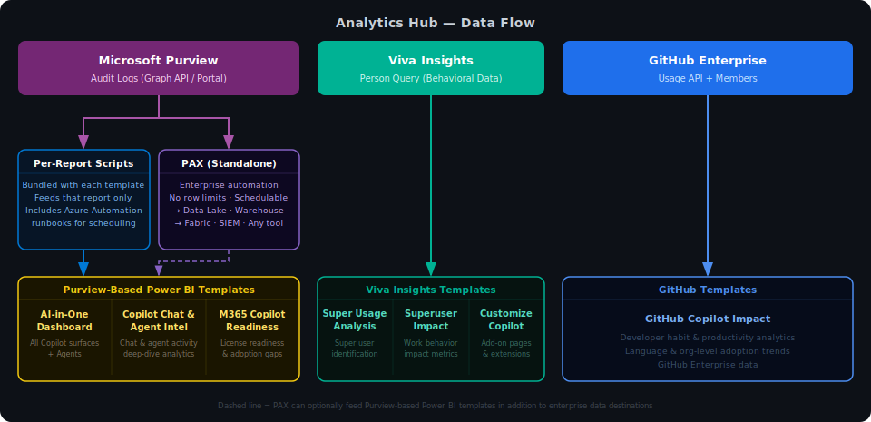

<div align="center">

<br>

# 🧠 Analytics Hub

### Open-source analytics tools for Microsoft Copilot and AI adoption

<br>

[](#-about-the-team)
[](#-quick-links)

<br>

**[Browse the Toolkit ↓](#-the-toolkit)** &nbsp;·&nbsp; **[Find Your Tool ↓](#-which-tool-do-i-need)** &nbsp;·&nbsp; **[Data Sources ↓](#-data-sources-at-a-glance)** &nbsp;·&nbsp; **[Case Studies ↓](#-client-stories)** &nbsp;·&nbsp; **[About the Team ↓](#-about-the-team)**

<br>

</div>

---

<div align="center">
<i>Nine production-ready Power BI templates, add-ons, and PowerShell automation tools built by Microsoft's Copilot ROI Advisory Team to help organizations understand and demonstrate the impact of Microsoft Copilot and AI.</i>
</div>

---

## What Is This?

The **Analytics Hub** is a curated collection of open-source analytics tools from Microsoft designed for one purpose: to help organizations understand how their people are adopting Microsoft Copilot and AI, turning that understanding into action.

Each tool in this hub is a standalone, downloadable resource. Together, they form a complete analytics ecosystem that spans the full Copilot adoption journey, from **license readiness**, to **active usage**, to **deep behavioral insights**, all the way to **measuring real business impact**.

> All tools are free, open-source, and link directly to original Microsoft repositories. No data is ever sent to Microsoft. Everything runs in your own environment.

---

## 🗺 The Ecosystem

There are three data source tracks and two ways to automate data collection. Understanding this upfront will save you a lot of time.



> **PAX is not a prerequisite for the Power BI templates.** Every Purview-based report ships with its own lightweight scripts for template-specific data collection, and manual export from the Purview portal always works too. PAX is the right choice when you need enterprise automation, compliance-grade exports, no row limits, or want to land data in a lake or warehouse for use beyond these templates.

---

## 🎯 Which Tool Do I Need?

| If you're asking... | Use this tool | Data source |
|---|---|---|
| Who are our Copilot super users, and how did they get there? | [Super Usage Adoption](#-super-usage-adoption) | Viva Insights |
| What's the measurable impact of super users on work patterns? | [Super User Impact](#-super-user-impact) | Viva Insights |
| How are people using Copilot Chat and Agents across our org? | [Copilot Chat & Agent Intelligence](#-copilot-chat--agent-intelligence) | Purview + Entra |
| I want a single dashboard showing all Copilot and Agent activity | [AI-in-One Dashboard](#-ai-in-one-dashboard) | Purview + Entra |
| How are developers adopting GitHub Copilot? | [GitHub Copilot Impact](#-github-copilot-impact) | GitHub Enterprise |
| Which users should get Copilot licenses next? | [M365 Copilot Readiness](#-m365-copilot-readiness-report) | Purview + Entra |
| How do employees feel about Copilot, and does that match actual usage? | [Adoption & Sentiment Report](#-adoption--sentiment-report) | M365 Admin Center + Survey |
| How do I automate pulling audit logs without manual exports? | [PAX: Portable Audit eXporter](#-pax-portable-audit-exporter) | Microsoft Graph API |
| I want to add custom pages or extend my Viva Insights reports | [CustomizeCopilot](#-customizecopilot-add-on-library) | Viva Insights |

---

## 🛠 The Toolkit

### ⚡ [Super Usage Adoption](https://github.com/microsoft/DecodingSuperUsage)

[](https://analysis.insights.cloud.microsoft/)
[](https://github.com/microsoft/DecodingSuperUsage)
[](https://github.com/microsoft/DecodingSuperUsage/archive/refs/heads/main.zip)

**Who are your Copilot super users, and how do you make more of them?**

This template uses Viva Insights organizational data to understand the path from first-time Copilot user to power user: what they use Copilot for, how quickly habits form, which teams are furthest along, and where to focus enablement efforts.

<details>
<summary><strong>What you can explore</strong></summary>

<br>

- **Super usage profile:** What does super usage look like at your org? Which Copilot surfaces are driving the deepest engagement?
- **The journey:** What did super users do differently in the early days? How fast are you producing them?
- **Work patterns:** What behavioral signals are associated with super users? Any early signs of productivity shifts?
- **Change management:** Where are super users concentrated? Which teams need enablement investment most?

</details>

<details>
<summary><strong>Dashboard preview</strong></summary>

<br>


</details>

*Full setup instructions and prerequisites are available in the repository.*

→ **[View Repository](https://github.com/microsoft/DecodingSuperUsage)** &nbsp;|&nbsp; **[Download Repository](https://github.com/microsoft/DecodingSuperUsage/archive/refs/heads/main.zip)** &nbsp;|&nbsp; **[Interpretation Guide](https://github.com/microsoft/DecodingSuperUsage/blob/DecodingSuperUsage/Interpretation%20Guide%20Super%20Usage%20Adoption.pdf)** &nbsp;|&nbsp; **[📧 Email Prerequisites](mailto:?subject=Action%20Required%3A%20Viva%20Insights%20Query%20Setup%20Needed%20for%20Super%20User%20Adoption%20Report%20%28Power%20BI%29&body=To%3A%20IT%20Admin%20%2F%20Global%20Admin%20%2F%20Viva%20Insights%20Administrator%0ARe%3A%20Super%20User%20Adoption%20%28DecodingSuperUsage%29%20%E2%80%93%20Power%20BI%20Report%20Setup%0A%0A%0AWHAT%20THIS%20REPORT%20DOES%0A%0AThe%20Super%20User%20Adoption%20Report%20is%20a%20Power%20BI%20report%20powered%20by%20Viva%20Insights%20data.%20It%20identifies%20how%20Copilot%20super%20users%20emerge%20in%20your%20organization%20%E2%80%94%20tracking%20the%20journey%20from%20activation%20to%20habitual%20use%20%E2%80%94%20and%20helps%20you%20understand%20what%20work%20patterns%2C%20collaboration%20behaviors%2C%20and%20surfaces%20distinguish%20super%20users%20from%20the%20rest.%20Used%20to%20replicate%20adoption%20paths%20and%20focus%20enablement%20on%20the%20right%20cohorts.%0A%0A%0ADATA%20SOURCE%20REQUIRED%0A%0AViva%20Insights%20%E2%80%93%20Person%20Query%0AExport%3A%20analysis.insights.cloud.microsoft%20-%3E%20Create%20analysis%20-%3E%20Person%20query%0AFormat%3A%20CSV%20or%20Direct%20Query%20%28via%20Partition%20ID%20%2B%20Query%20ID%29%0A%0A%0AREQUIRED%20FIELDS%20%E2%80%94%20DO%20NOT%20REMOVE%0A%0AIMPORTANT%3A%20The%20Viva%20Insights%20Person%20Query%20must%20include%20ALL%20metrics%20listed%20below.%20Missing%20even%20one%20metric%20group%20will%20cause%20blank%20visuals%20in%20Power%20BI%20with%20no%20error.%20Do%20not%20export%20a%20partial%20query%20or%20remove%20columns%20from%20the%20CSV%20after%20export.%0A%0APerson%20Query%20%E2%80%94%20Required%20Metric%20Groups%20%28select%20%22All%20metrics%22%20for%20each%29%3A%0AMicrosoft%20365%20Copilot%20%28all%20metrics%29%2C%20Collaboration%20network%20%28all%20metrics%29%2C%20Working%20hours%20collaboration%20%28all%20metrics%29%2C%20Focus%20metrics%20%28all%20metrics%29.%0A%0ASpecific%20fields%20the%20report%20depends%20on%3A%0ACopilot_Active_Use_Days_per_week%2C%20Copilot_Total_Actions%2C%20Copilot_Total_Chats%2C%20Copilot_Total_Emails_with_Copilot%2C%20Copilot_Total_Documents_with_Copilot%2C%20Copilot_Total_Meeting_Summaries%2C%20Copilot_Total_Pages_with_Copilot%2C%20Copilot_Total_Teams_Chat_Copilot_Interactions%2C%20Copilot_Total_Word_Copilot_Interactions%2C%20Copilot_Total_Excel_Copilot_Interactions%2C%20Copilot_Total_PowerPoint_Copilot_Interactions%2C%20Copilot_Total_Outlook_Copilot_Interactions%2C%20Collaboration_hours%2C%20Meeting_hours%2C%20After_hours_collaboration_hours%2C%20Email_hours%2C%20Focus_hours%2C%20Uninterrupted_focus_hours%2C%20Internal_network_size%2C%20Strong_ties%2C%20Diverse_ties.%0A%0APerson%20Query%20%E2%80%94%20Required%20Attributes%20%28Dimensions%29%3A%0APersonId%2C%20Organization%2C%20FunctionType%2C%20TimeZone%2C%20IsActive.%0A%0AQuery%20Configuration%20%E2%80%94%20Required%20Settings%3A%0A-%20Time%20period%3A%20Last%206%20months%20%28rolling%29%0A-%20Group%20by%3A%20Week%20%28not%20Month%20%E2%80%94%20month%20grouping%20breaks%20trend%20calculations%29%0A-%20Filter%3A%20Is%20Active%20%3D%20True%0A%0A%0AINSIGHTS%20YOU%20WILL%20GAIN%0A%0A-%20Super%20user%20identification%20and%20tier%20classification%20%28light%20to%20super%20user%29%0A-%20Activation-to-habit%20journey%3A%20how%20fast%20users%20become%20super%20users%20and%20whether%20the%20behavior%20is%20durable%0A-%20Surface%20breakdown%3A%20which%20Copilot%20apps%20%28Word%2C%20Excel%2C%20Teams%2C%20Outlook%2C%20Chat%29%20super%20users%20engage%20with%20most%0A-%20Work%20pattern%20comparison%3A%20collaboration%20hours%2C%20meeting%20hours%2C%20focus%20time%2C%20and%20network%20size%20for%20super%20users%20vs.%20peers%0A-%20Team%20concentration%3A%20where%20super%20users%20are%20clustered%2C%20to%20focus%20enablement%20where%20momentum%20already%20exists%0A%0A%0AROLES%20%26%20PERMISSIONS%20REQUIRED%0A%0ACreate%20and%20run%20Person%20Query%20in%20Viva%20Insights%3A%20Insights%20Analyst%20%28assigned%20in%20Viva%20Insights%20Admin%29%0AAccess%20Viva%20Insights%20Analyst%20Workbench%3A%20Insights%20Analyst%20or%20Insights%20Administrator%0AExport%20query%20results%20as%20CSV%3A%20Insights%20Analyst%0A%0A%0ASOFTWARE%20REQUIREMENTS%0A%0A-%20Power%20BI%20Desktop%20%E2%80%94%20required%20to%20open%20the%20.pbit%20template%20file%0A-%20Access%20to%3A%20analysis.insights.cloud.microsoft%20%28Viva%20Insights%20Analyst%20Workbench%29%0A-%20Microsoft%20365%20Viva%20Insights%20license%20%E2%80%94%20required%20for%20the%20organization%20to%20generate%20Person%20Query%20data%0A%0A%0ATWO%20CONNECTION%20OPTIONS%0A%0ACSV%20Import%20%28.pbit%29%3A%20Run%20query%20-%3E%20export%20CSV%20-%3E%20point%20Power%20BI%20template%20to%20the%20CSV%20file%20path%0ADirect%20Query%20%28.pbit%29%3A%20Copy%20the%20Partition%20ID%20and%20Query%20ID%20from%20the%20completed%20query%20and%20enter%20them%20into%20the%20Power%20BI%20template%20%E2%80%94%20no%20CSV%20download%20needed%3B%20report%20refreshes%20automatically%20with%20each%20weekly%20Viva%20Insights%20update%0A%0AQuery%20must%20show%20Status%20%3D%20Completed%20before%20export%20or%20Direct%20Query%20connection.%20Do%20not%20export%20mid-processing.)** &nbsp;|&nbsp; **[⭐ Star](https://github.com/microsoft/DecodingSuperUsage/stargazers)** &nbsp;|&nbsp; **[👀 Watch](https://github.com/microsoft/DecodingSuperUsage/subscription)**

---

### 🏆 [Super User Impact](https://github.com/microsoft/superuserimpact)

[](https://analysis.insights.cloud.microsoft/)
[](https://github.com/microsoft/superuserimpact)
[](https://github.com/microsoft/superuserimpact/archive/refs/heads/main.zip)

**What is the measurable impact of Copilot on how your super users work?**

Goes beyond adoption metrics to measure actual impact on work patterns. This template explores behavioral changes associated with super users, along with estimated value delivered, and where available, sentiment signals. Cross-team comparisons and cohort-level views make it easier to build a business case for Copilot.

<details>
<summary><strong>What you can explore</strong></summary>

<br>

- **Impact measurement:** Work pattern deltas before and after super user status emerges
- **Sentiment signals:** Sentiment overlay (when available) to contextualize behavioral change
- **Estimated value:** Quantified value estimates tied to time savings and collaboration shifts
- **Cross-team comparison:** Benchmark super user cohorts across functions and orgs
- **Usage tiers:** Static threshold-based tier classification for clearer benchmarking

</details>

<details>
<summary><strong>Dashboard preview</strong></summary>

<br>


</details>

*Full setup instructions and prerequisites are available in the repository.*

→ **[View Repository](https://github.com/microsoft/superuserimpact)** &nbsp;|&nbsp; **[Download Repository](https://github.com/microsoft/superuserimpact/archive/refs/heads/main.zip)** &nbsp;|&nbsp; **[📧 Email Prerequisites](mailto:?subject=Action%20Required%3A%20Viva%20Insights%20Query%20Setup%20Needed%20for%20Super%20User%20Impact%20Report%20%28Power%20BI%29&body=To%3A%20IT%20Admin%20%2F%20Global%20Admin%20%2F%20Viva%20Insights%20Administrator%0ARe%3A%20Super%20User%20Impact%20%E2%80%93%20Power%20BI%20Report%20Setup%0A%0A%0AWHAT%20THIS%20REPORT%20DOES%0A%0AThe%20Super%20User%20Impact%20Report%20is%20a%20Power%20BI%20report%20powered%20by%20Viva%20Insights%20data.%20Where%20the%20Super%20User%20Adoption%20report%20tracks%20who%20super%20users%20are%2C%20this%20report%20measures%20what%20changed%20in%20their%20work%20patterns%20as%20a%20result%20of%20Copilot%20adoption%20%E2%80%94%20including%20collaboration%20hours%2C%20meeting%20load%2C%20focus%20time%2C%20and%20estimated%20time%20saved.%20Includes%20cross-team%20benchmarking%20and%20optional%20sentiment%20signal%20analysis.%20Used%20to%20demonstrate%20ROI%20and%20guide%20change%20management.%0A%0A%0ADATA%20SOURCE%20REQUIRED%0A%0AViva%20Insights%20%E2%80%93%20Person%20Query%0AExport%3A%20analysis.insights.cloud.microsoft%20-%3E%20Create%20analysis%20-%3E%20Person%20query%0AFormat%3A%20CSV%20or%20Direct%20Query%20%28via%20Partition%20ID%20%2B%20Query%20ID%29%0A%0A%0AREQUIRED%20FIELDS%20%E2%80%94%20DO%20NOT%20REMOVE%0A%0AIMPORTANT%3A%20This%20report%20uses%20the%20same%20Viva%20Insights%20Person%20Query%20as%20the%20Super%20User%20Adoption%20report.%20All%20metric%20groups%20must%20be%20selected%20in%20full.%20Partial%20exports%20or%20manually%20edited%20CSVs%20with%20removed%20columns%20will%20cause%20blank%20visuals%20and%20broken%20calculations.%0A%0APerson%20Query%20%E2%80%94%20Required%20Metric%20Groups%20%28select%20%22All%20metrics%22%20for%20each%29%3A%0AMicrosoft%20365%20Copilot%20%28all%20metrics%29%2C%20Collaboration%20network%20%28all%20metrics%29%2C%20Working%20hours%20collaboration%20%28all%20metrics%29%2C%20Focus%20metrics%20%28all%20metrics%29.%0A%0ASpecific%20fields%20the%20report%20depends%20on%3A%0ACopilot_Active_Use_Days_per_week%2C%20Copilot_Total_Actions%2C%20Copilot_Total_Chats%2C%20Collaboration_hours%2C%20Meeting_hours%2C%20After_hours_collaboration_hours%2C%20Email_hours%2C%20Meeting_hours_with_manager_1_on_1%2C%20Focus_hours%2C%20Uninterrupted_focus_hours%2C%20Internal_network_size%2C%20Strong_ties%2C%20Diverse_ties.%0A%0APerson%20Query%20%E2%80%94%20Required%20Attributes%20%28Dimensions%29%3A%0APersonId%2C%20Organization%2C%20FunctionType%2C%20TimeZone%2C%20IsActive.%0A%0AQuery%20Configuration%20%E2%80%94%20Required%20Settings%3A%0A-%20Time%20period%3A%20Last%206%20months%20%28rolling%29%0A-%20Group%20by%3A%20Week%20%28not%20Month%29%0A-%20Filter%3A%20Is%20Active%20%3D%20True%0A%0A%0AINSIGHTS%20YOU%20WILL%20GAIN%0A%0A-%20Work%20pattern%20delta%20analysis%3A%20how%20collaboration%20hours%2C%20meeting%20time%2C%20email%20time%2C%20and%20focus%20time%20differ%20between%20super%20users%20and%20their%20peers%0A-%20After-hours%20work%20impact%3A%20whether%20Copilot%20adoption%20correlates%20with%20better%20or%20worse%20work-life%20balance%20signals%0A-%20Time%20saved%20estimation%3A%20calculated%20value%20model%20based%20on%20total%20Copilot%20actions%0A-%20Network%20changes%3A%20whether%20super%20users%20have%20broader%20or%20deeper%20internal%20collaboration%20networks%0A-%20Cross-team%20benchmarking%3A%20compare%20impact%20signals%20across%20organizations%2C%20function%20types%2C%20and%20usage%20tiers%0A-%20Manager%201%3A1%20time%3A%20changes%20in%20coaching%20and%20alignment%20meeting%20patterns%0A%0A%0AROLES%20%26%20PERMISSIONS%20REQUIRED%0A%0ACreate%20and%20run%20Person%20Query%20in%20Viva%20Insights%3A%20Insights%20Analyst%20%28assigned%20in%20Viva%20Insights%20Admin%29%0AAccess%20Viva%20Insights%20Analyst%20Workbench%3A%20Insights%20Analyst%20or%20Insights%20Administrator%0AExport%20query%20results%20as%20CSV%3A%20Insights%20Analyst%0A%0A%0ASOFTWARE%20REQUIREMENTS%0A%0A-%20Power%20BI%20Desktop%20%E2%80%94%20required%20to%20open%20the%20.pbit%20template%20file%0A-%20Access%20to%3A%20analysis.insights.cloud.microsoft%20%28Viva%20Insights%20Analyst%20Workbench%29%0A-%20Microsoft%20365%20Viva%20Insights%20license%20%E2%80%94%20required%20for%20the%20organization%20to%20generate%20Person%20Query%20data%0A%0A%0ANote%3A%0AThe%20Super%20User%20Impact%20report%20uses%20the%20same%20Person%20Query%20as%20the%20Super%20User%20Adoption%20report.%20If%20both%20reports%20are%20being%20deployed%20simultaneously%2C%20a%20single%20query%20export%20can%20feed%20both%20templates%20%E2%80%94%20no%20need%20to%20run%20separate%20queries.)** &nbsp;|&nbsp; **[⭐ Star](https://github.com/microsoft/superuserimpact/stargazers)** &nbsp;|&nbsp; **[👀 Watch](https://github.com/microsoft/superuserimpact/subscription)**

---

### 🧩 [CustomizeCopilot: Add-on Library](https://github.com/microsoft/customizecopilot)

[](https://analysis.insights.cloud.microsoft/)
[](https://github.com/microsoft/customizecopilot)
[](https://github.com/microsoft/customizecopilot/archive/refs/heads/main.zip)

**Extend your Viva Insights reports with plug-and-play add-on pages without starting from scratch.**

A growing library of modular Power BI pages that drop directly into the Super Usage Adoption and Super User Impact templates. Each add-on is pre-configured with its own measures and visuals, compatible with both templates, and maintained alongside the base reports.

<details>
<summary><strong>Current add-ons</strong></summary>

<br>

**Champion ID Pages.** Two person-level analytics pages for identifying your top Copilot champions. Shows individual usage rankings across all M365 apps, Copilot action breakdowns, network influence metrics (strong ties, diverse ties, internal network size), and temporal usage patterns. Ideal for peer training programs, recognition initiatives, and targeted coaching.

*Compatible with Super User Adoption v5+ and Super User Impact v5+. Requires 25 measures, all included automatically in the latest template versions.*

</details>

<details>
<summary><strong>How to add pages to your report</strong></summary>

<br>

**Option A: Power BI Desktop (easiest):**
1. Open your base report and a second Power BI Desktop instance with the add-on file
2. Right-click the page you want → Copy → paste into your base report
3. Verify visuals load and save

**Option B: Power BI Project files (.pbip):**
1. Copy the page folder from the add-on into your report's `definition/pages/` directory
2. Add the page GUID to `pages.json`
3. Open in Power BI Desktop and verify

</details>

*Full setup instructions and prerequisites are available in the repository.*

→ **[View Repository](https://github.com/microsoft/customizecopilot)** &nbsp;|&nbsp; **[Download Repository](https://github.com/microsoft/customizecopilot/archive/refs/heads/main.zip)** &nbsp;|&nbsp; **[⭐ Star](https://github.com/microsoft/customizecopilot/stargazers)** &nbsp;|&nbsp; **[👀 Watch](https://github.com/microsoft/customizecopilot/subscription)**

---

### 🤖 [AI-in-One Dashboard](https://github.com/microsoft/AI-in-One-Dashboard)

[](https://security.microsoft.com)
[](https://entra.microsoft.com)
[](https://github.com/microsoft/AI-in-One-Dashboard)
[](https://github.com/microsoft/AI-in-One-Dashboard/archive/refs/heads/main.zip)

**Every Copilot and Agent interaction in one place, from licensed M365 Copilot to third-party AI.**

Pulls from Purview audit logs to give you a single view of M365 Copilot usage, unlicensed Copilot Chat, and Agent activity across your organization. Covers adoption trends, license utilization, and readiness, all in one template.

> **New:** The Agent Dashboard feature is now in public preview, providing one-click visibility into agent usage. Work with your IT admin to enable it.

<details>
<summary><strong>What you can explore</strong></summary>

<br>

- **Comprehensive coverage:** M365 Copilot, unlicensed Copilot Chat, custom agents, and third-party AI apps (Confluence, Jira, Miro, and more)
- **User engagement tracking:** Adoption trends over time across all Copilot surfaces
- **License intelligence:** Licensed vs. unlicensed usage patterns to optimize allocation
- **Agent inventory:** Full catalog of agents deployed in your tenant via the Agent Registry
- **Org segmentation:** Slice any view by department, role, or custom attributes
- **Two setup paths:** Manual portal export or fully automated PowerShell scripts

</details>

<details>
<summary><strong>Dashboard preview</strong></summary>

<br>


</details>

*Full setup instructions and prerequisites are available in the repository.*

→ **[View Repository](https://github.com/microsoft/AI-in-One-Dashboard)** &nbsp;|&nbsp; **[Interpretation Guide](https://github.com/microsoft/AI-in-One-Dashboard/blob/main/AI-in-One%20-%20Interpretation%20Guide.pdf)** &nbsp;|&nbsp; **[📧 Email Prerequisites](mailto:?subject=Action%20Required%3A%20Data%20Export%20Fields%20Needed%20for%20AI-in-One%20Dashboard%20%28Power%20BI%29&body=To%3A%20IT%20Admin%20%2F%20Global%20Admin%0ARe%3A%20AI-in-One%20Dashboard%20%E2%80%93%20Power%20BI%20Report%20Setup%0A%0A%0AWHAT%20THIS%20REPORT%20DOES%0A%0AThe%20AI-in-One%20Dashboard%20is%20a%20Power%20BI%20report%20that%20provides%20a%20comprehensive%20view%20of%20Microsoft%20365%20Copilot%2C%20unlicensed%20Copilot%20Chat%2C%20agent%20usage%2C%20and%20third-party%20AI%20adoption%20across%20your%20organization.%20It%20consolidates%20four%20data%20sources%20into%20a%20single%20dashboard%20for%20adoption%20tracking%2C%20license%20optimization%2C%20and%20enablement%20planning.%0A%0A%0ADATA%20SOURCES%20REQUIRED%0A%0A1.%20Microsoft%20Purview%20%E2%80%93%20Copilot%20Audit%20Logs%0A%20%20%20Export%3A%20Purview%20portal%20%28security.microsoft.com%29%20-%3E%20Audit%20-%3E%20Export%2C%20or%20PAX%20PowerShell%20script%0A%20%20%20Format%3A%20CSV%0A%0A2.%20Microsoft%20Entra%20ID%20%E2%80%93%20User%2FOrg%20Data%20%28includes%20license%20data%29%0A%20%20%20Export%3A%20entra.microsoft.com%20-%3E%20Identity%20-%3E%20Users%20-%3E%20Download%20users%2C%20or%20PAX%20script%20with%20-IncludeUserInfo%0A%20%20%20Format%3A%20CSV%0A%0A3.%20Microsoft%20365%20Admin%20Center%20%E2%80%93%20Agent%20365%20Inventory%0A%20%20%20Export%3A%20admin.microsoft.com%20-%3E%20Agents%20-%3E%20All%20Agents%20-%3E%20Export%20to%20Excel%0A%20%20%20Format%3A%20XLSX%0A%0A4.%20%28if%20not%20using%20PAX%29%20Microsoft%20365%20Admin%20Center%20%E2%80%93%20Licensed%20Users%0A%20%20%20Export%3A%20admin.microsoft.com%20-%3E%20Reports%20-%3E%20Usage%20-%3E%20M365%20Copilot%20-%3E%20Readiness%20tab%20-%3E%20Export%0A%20%20%20Format%3A%20CSV%0A%0ANote%20on%20license%20data%3A%20The%20report%20requires%20a%20hasLicense%20flag%20to%20split%20licensed%20vs.%20unlicensed%20Copilot%20usage.%20The%20PAX%20script%20automatically%20adds%20this%20column%20to%20the%20Entra%20user%20export%20%E2%80%94%20no%20separate%20file%20needed.%20If%20you%20are%20exporting%20manually%20from%20Entra%2C%20you%20will%20also%20need%20the%20M365%20Admin%20Center%20licensed%20users%20file%20%28source%20%234%29%20and%20provide%20it%20as%20a%20separate%20input%20to%20the%20template.%0A%0A%0AREQUIRED%20FIELDS%20%E2%80%94%20DO%20NOT%20REMOVE%0A%0AIMPORTANT%3A%20If%20you%20are%20running%20a%20PAX%20Purview%20agent%20extract%20or%20manually%20exporting%20from%20Purview%2C%20do%20not%20prune%20or%20remove%20columns%20from%20the%20output%20files.%20The%20report%20will%20silently%20break%20or%20produce%20blank%20visuals%20if%20any%20of%20the%20following%20fields%20are%20missing.%0A%0APurview%20Audit%20Log%20%28CopilotInteraction%20%2F%20ConnectedAIAppInteraction%20%2F%20AIAppInteraction%29%3A%0ACreationDate%2C%20UserId%2C%20Operations%2C%20AppHost%2C%20ThreadId%2C%20AgentId%2C%20AgentName%2C%20AISystemPlugin_Id%2C%20AISystemPlugin_Name%2C%20Context_Type%2C%20Message_isPrompt%2C%20ModelTransparencyDetails_ModelName%2C%20Workload%2C%20OrganizationId%2C%20AppIdentity_DisplayName.%0A%0AMicrosoft%20Entra%20ID%20%E2%80%93%20User%20Export%3A%0AUserPrincipalName%2C%20Department%2C%20JobTitle%2C%20displayName%2C%20hasLicense%20%28added%20automatically%20by%20PAX%3B%20or%20use%20the%20M365%20Admin%20Center%20licensed%20users%20file%20if%20exporting%20manually%29%2C%20Manager%2C%20Office%2C%20City%2C%20Country.%0A%0AM365%20Admin%20Center%20%E2%80%93%20Licensed%20Users%20%28manual%20export%20path%20only%29%3A%0AUserPrincipalName%2C%20Has%20Copilot%20License%20Assigned.%0A%0AAgent%20365%20Inventory%3A%0AName%2C%20Host%20Products%2C%20Created%20Date%2C%20Developer%20User%20ID%2C%20Description%2C%20Status%2C%20Version.%0A%0A%0AINSIGHTS%20YOU%20WILL%20GAIN%0A%0A-%20Active%20Copilot%20users%20and%20interaction%20volume%20by%20week%2Fmonth%0A-%20Surface%20breakdown%3A%20which%20apps%20%28Teams%2C%20Word%2C%20Outlook%2C%20BizChat%2C%20etc.%29%20users%20are%20engaging%20with%0A-%20Agent%20adoption%3A%20which%20agents%20are%20used%2C%20by%20how%20many%20users%2C%20on%20which%20surfaces%0A-%20AI%20model%20distribution%20across%20interactions%0A-%20Licensed%20vs.%20unlicensed%20usage%20patterns%0A-%20Session%20depth%20and%20prompt%20volume%20per%20user%20cohort%0A-%20Third-party%20and%20custom%20AI%20app%20usage%20alongside%20M365%20Copilot%0A%0A%0AROLES%20%26%20PERMISSIONS%20REQUIRED%0A%0AExport%20Purview%20audit%20logs%3A%20Audit%20Reader%20or%20Compliance%20Administrator%0AExport%20Entra%20user%20data%20%28includes%20hasLicense%20via%20PAX%29%3A%20User%20Administrator%20or%20Global%20Reader%0AExport%20Agent%20365%20inventory%3A%20AI%20Admin%20or%20Global%20Reader%0AExport%20M365%20Admin%20Center%20licensed%20users%20%28manual%20path%20only%29%3A%20Global%20Administrator%20or%20Reports%20Reader%0ARun%20PAX%20PowerShell%20script%20%28automated%20export%29%3A%20Audit%20Reader%20%2B%20Microsoft%20Graph%20API%20permissions%20%28AuditLog.Read.All%2C%20User.Read.All%2C%20Organization.Read.All%29%0A%0A%0ASOFTWARE%20REQUIREMENTS%0A%0A-%20Power%20BI%20Desktop%20%28free%20download%20from%20Microsoft%29%20%E2%80%94%20required%20to%20open%20the%20.pbit%20template%0A-%20PowerShell%205.1%2B%20%E2%80%94%20required%20only%20if%20using%20the%20PAX%20automated%20export%20script%0A-%20Microsoft%20Graph%20PowerShell%20module%20%E2%80%94%20required%20only%20for%20PAX%20script%20%28Install-Module%20Microsoft.Graph.Beta.Security%29%0A-%20Access%20to%3A%20security.microsoft.com%2C%20admin.microsoft.com%2C%20entra.microsoft.com%0A%0A%0ANote%20on%20Usernames%20in%20Reports%3A%0AIf%20user%20names%20appear%20concealed%20in%20M365%20Admin%20Center%20exports%2C%20go%20to%20Settings%20-%3E%20Org%20Settings%20-%3E%20Services%20-%3E%20Reports%20and%20uncheck%20%22Display%20concealed%20user%2C%20group%2C%20and%20site%20names%20in%20all%20reports%22%20before%20exporting.)** &nbsp;|&nbsp; **[⭐ Star](https://github.com/microsoft/AI-in-One-Dashboard/stargazers)** &nbsp;|&nbsp; **[👀 Watch](https://github.com/microsoft/AI-in-One-Dashboard/subscription)**

---

### 💬 [Copilot Chat & Agent Intelligence](https://github.com/microsoft/CopilotChatAnalytics)

[](https://security.microsoft.com)
[](https://entra.microsoft.com)
[](https://github.com/microsoft/CopilotChatAnalytics)
[](https://github.com/microsoft/CopilotChatAnalytics/archive/refs/heads/main.zip)

**Deep-dive analytics on Copilot Chat sessions and Agent adoption, with two purpose-built templates.**

Where the AI-in-One Dashboard gives you the full picture, this repo goes deep on **Chat** and **Agents** specifically. The Chat Intelligence report breaks down prompt volume, session patterns, and engagement progression from light to habitual use. The Agent Intelligence report shows which agents are being used, by whom, and how adoption is trending.

<details>
<summary><strong>Two templates, two lenses</strong></summary>

<br>

**Chat Intelligence:** Prompts, sessions, surface breakdown, user engagement tiers, and licensing readiness signals across Copilot Chat.

**Agent Intelligence:** Agent adoption across licensed and free experiences, segmented by org, quartile, and surface. Identify adoption hotspots and quantify agent ROI.

</details>

<details>
<summary><strong>Dashboard previews</strong></summary>

<br>

**Agent Intelligence:**


**Chat Intelligence:**


</details>

*Full setup instructions and prerequisites are available in the repository.*

→ **[View Repository](https://github.com/microsoft/CopilotChatAnalytics)** &nbsp;|&nbsp; **[Agent Intelligence Guide](https://github.com/microsoft/CopilotChatAnalytics/blob/main/AgentIntelligenceGuide.pdf)** &nbsp;|&nbsp; **[Chat Interpretation Guide](https://github.com/microsoft/CopilotChatAnalytics/blob/main/Copilot%20Chat%20-%20Interpretation%20Guide.pdf)** &nbsp;|&nbsp; **[📧 Chat Email Prerequisites](mailto:?subject=Action%20Required%3A%20Data%20Export%20Fields%20Needed%20for%20Chat%20Intelligence%20Report%20%28Power%20BI%29&body=To%3A%20IT%20Admin%20%2F%20Global%20Admin%0ARe%3A%20Copilot%20Chat%20Intelligence%20%E2%80%93%20Power%20BI%20Report%20Setup%0A%0A%0AWHAT%20THIS%20REPORT%20DOES%0A%0AThe%20Chat%20Intelligence%20Report%20is%20a%20Power%20BI%20report%20that%20analyzes%20Microsoft%20365%20Copilot%20Chat%20usage%20across%20your%20organization.%20It%20segments%20users%20by%20engagement%20level%20%28light%20to%20habitual%29%2C%20tracks%20session%20and%20prompt%20volume%20over%20time%2C%20and%20identifies%20adoption%20hotspots%20and%20licensing%20readiness%20signals%20by%20surface%2C%20org%20unit%2C%20and%20quartile.%0A%0A%0ADATA%20SOURCES%20REQUIRED%0A%0A1.%20Microsoft%20Purview%20%E2%80%93%20Copilot%20Audit%20Logs%0A%20%20%20Export%3A%20Purview%20portal%20%28security.microsoft.com%29%20-%3E%20Audit%20-%3E%20Activities%3A%20%22Interacted%20with%20Copilot%22%20-%3E%20Export%2C%20or%20PAX%20PowerShell%20script%0A%20%20%20Format%3A%20CSV%0A%0A2.%20Microsoft%20Entra%20ID%20%E2%80%93%20User%2FOrg%20Data%20%28includes%20license%20data%29%0A%20%20%20Export%3A%20entra.microsoft.com%20-%3E%20Identity%20-%3E%20Users%20-%3E%20Download%20users%2C%20or%20PAX%20script%20with%20-IncludeUserInfo%0A%20%20%20Format%3A%20CSV%0A%0A3.%20%28if%20not%20using%20PAX%29%20Microsoft%20365%20Admin%20Center%20%E2%80%93%20Licensed%20Users%0A%20%20%20Export%3A%20admin.microsoft.com%20-%3E%20Reports%20-%3E%20Usage%20-%3E%20M365%20Copilot%20-%3E%20Readiness%20tab%20-%3E%20Export%0A%20%20%20Format%3A%20CSV%0A%0ANote%20on%20license%20data%3A%20The%20report%20requires%20a%20hasLicense%20flag%20to%20separate%20licensed%20from%20unlicensed%20Copilot%20Chat%20usage.%20The%20PAX%20script%20automatically%20adds%20this%20column%20to%20the%20Entra%20user%20export%20%E2%80%94%20no%20separate%20file%20needed.%20If%20you%20are%20exporting%20manually%20from%20Entra%2C%20you%20will%20also%20need%20the%20M365%20Admin%20Center%20licensed%20users%20file%20%28source%20%233%29%20provided%20as%20a%20separate%20input.%0A%0A%0AREQUIRED%20FIELDS%20%E2%80%94%20DO%20NOT%20REMOVE%0A%0AIMPORTANT%3A%20If%20you%20are%20running%20a%20PAX%20Purview%20agent%20extract%20or%20manually%20exporting%20from%20Purview%2C%20do%20not%20remove%20or%20rename%20any%20columns%20from%20the%20output.%20Missing%20fields%20cause%20blank%20visuals%20with%20no%20error%20message.%0A%0APurview%20Audit%20Log%20%28CopilotInteraction%20%E2%80%93%20Record%20Type%2061%29%3A%0ACreationDate%2C%20UserId%2C%20Operations%2C%20AppHost%2C%20ThreadId%2C%20AgentId%2C%20Message_isPrompt.%0A%0AMicrosoft%20Entra%20ID%20%E2%80%93%20User%20Export%3A%0AUserPrincipalName%2C%20Department%2C%20hasLicense%20%28added%20automatically%20by%20PAX%3B%20or%20use%20the%20M365%20Admin%20Center%20licensed%20users%20file%20if%20exporting%20manually%29.%0A%0AM365%20Admin%20Center%20%E2%80%93%20Licensed%20Users%20%28manual%20export%20path%20only%29%3A%0AUserPrincipalName%2C%20Has%20Copilot%20License%20Assigned.%0A%0A%0AINSIGHTS%20YOU%20WILL%20GAIN%0A%0A-%20User%20engagement%20segmentation%3A%20light%2C%20moderate%2C%20regular%2C%20habitual%20Copilot%20Chat%20users%0A-%20Week-over-week%20session%20and%20prompt%20volume%20trends%0A-%20Surface%20breakdown%3A%20where%20chat%20usage%20is%20concentrated%20%28BizChat%2C%20Teams%2C%20M365%20apps%29%0A-%20Licensed%20vs.%20unlicensed%20chat%20usage%20patterns%0A-%20Agent-assisted%20vs.%20standard%20chat%20session%20split%0A-%20Org-level%20adoption%20comparison%20by%20department%20or%20quartile%0A%0A%0AROLES%20%26%20PERMISSIONS%20REQUIRED%0A%0AExport%20Purview%20audit%20logs%3A%20Audit%20Reader%20or%20Compliance%20Administrator%0AExport%20Entra%20user%20data%20%28includes%20hasLicense%20via%20PAX%29%3A%20User%20Administrator%20or%20Global%20Reader%0AExport%20M365%20Admin%20Center%20licensed%20users%20%28manual%20path%20only%29%3A%20Global%20Administrator%20or%20Reports%20Reader%0ARun%20PAX%20script%20%28optional%20automation%29%3A%20Audit%20Reader%20%2B%20AuditLog.Read.All%2C%20User.Read.All%20%28Microsoft%20Graph%29%0A%0A%0ASOFTWARE%20REQUIREMENTS%0A%0A-%20Power%20BI%20Desktop%20%E2%80%94%20required%20to%20open%20the%20.pbit%20template%20file%0A-%20PowerShell%205.1%2B%20%E2%80%94%20required%20only%20if%20using%20the%20PAX%20automated%20export%20script%0A-%20Access%20to%3A%20security.microsoft.com%2C%20admin.microsoft.com%2C%20entra.microsoft.com%0A%0A%0ANote%20on%20Usernames%3A%0AEnsure%20user%20display%20names%20are%20not%20concealed%20in%20M365%20Admin%20Center%20reports%20before%20exporting.%20Go%20to%20Settings%20-%3E%20Org%20Settings%20-%3E%20Services%20-%3E%20Reports%20and%20uncheck%20%22Display%20concealed%20user%2C%20group%2C%20and%20site%20names%20in%20all%20reports.%22%0A%0ANote%20on%20Hash%20String%3A%0AWhen%20opening%20the%20Power%20BI%20template%2C%20you%20will%20be%20prompted%20for%20a%20hash%20string.%20Provide%20any%20text%20string%20%E2%80%94%20this%20is%20used%20to%20de-identify%20sensitive%20user%20identifiers%20in%20the%20report%20output%20before%20sharing.)** &nbsp;|&nbsp; **[📧 Agent Email Prerequisites](mailto:?subject=Action%20Required%3A%20Data%20Export%20Fields%20Needed%20for%20Agent%20Intelligence%20Report%20%28Power%20BI%29&body=To%3A%20IT%20Admin%20%2F%20Global%20Admin%0ARe%3A%20Copilot%20Agent%20Intelligence%20%E2%80%93%20Power%20BI%20Report%20Setup%0A%0A%0AWHAT%20THIS%20REPORT%20DOES%0A%0AThe%20Agent%20Intelligence%20Report%20is%20a%20Power%20BI%20report%20that%20tracks%20adoption%20of%20Microsoft%20365%20Copilot%20agents%20across%20your%20organization.%20It%20ranks%20agents%20by%20usage%20and%20unique%20user%20reach%2C%20shows%20which%20M365%20surfaces%20agents%20are%20deployed%20on%2C%20and%20distinguishes%20licensed%20vs.%20free-tier%20agent%20interactions.%20Designed%20for%20organizations%20deploying%20custom%20or%20third-party%20Copilot%20agents%20at%20scale.%0A%0A%0ADATA%20SOURCES%20REQUIRED%0A%0A1.%20Microsoft%20Purview%20%E2%80%93%20Copilot%20Audit%20Logs%0A%20%20%20Export%3A%20Purview%20portal%20%28security.microsoft.com%29%20-%3E%20Audit%20-%3E%20Activities%3A%20%22Interacted%20with%20Copilot%22%20-%3E%20Export%2C%20or%20PAX%20PowerShell%20script%0A%20%20%20Format%3A%20CSV%0A%0A2.%20Microsoft%20Entra%20ID%20%E2%80%93%20User%2FOrg%20Data%20%28includes%20license%20data%29%0A%20%20%20Export%3A%20entra.microsoft.com%20-%3E%20Identity%20-%3E%20Users%20-%3E%20Download%20users%2C%20or%20PAX%20script%20with%20-IncludeUserInfo%0A%20%20%20Format%3A%20CSV%0A%0A3.%20%28if%20not%20using%20PAX%29%20Microsoft%20365%20Admin%20Center%20%E2%80%93%20Licensed%20Users%0A%20%20%20Export%3A%20admin.microsoft.com%20-%3E%20Reports%20-%3E%20Usage%20-%3E%20M365%20Copilot%20-%3E%20Readiness%20tab%20-%3E%20Export%0A%20%20%20Format%3A%20CSV%0A%0ANote%20on%20license%20data%3A%20The%20report%20requires%20a%20hasLicense%20flag%20to%20split%20licensed%20vs.%20free-tier%20agent%20interactions.%20The%20PAX%20script%20automatically%20adds%20this%20column%20to%20the%20Entra%20user%20export%20%E2%80%94%20no%20separate%20file%20needed.%20If%20you%20are%20exporting%20manually%20from%20Entra%2C%20you%20will%20also%20need%20the%20M365%20Admin%20Center%20licensed%20users%20file%20%28source%20%233%29%20provided%20as%20a%20separate%20input.%0A%0A%0AREQUIRED%20FIELDS%20%E2%80%94%20DO%20NOT%20REMOVE%0A%0AIMPORTANT%3A%20Agent-related%20fields%20%28AgentId%2C%20AgentName%2C%20AISystemPlugin_Name%29%20are%20nested%20inside%20the%20AuditData%20JSON%20in%20raw%20Purview%20exports%20and%20are%20flattened%20by%20the%20PAX%20script.%20If%20these%20columns%20are%20removed%20from%20a%20PAX%20output%20file%2C%20all%20agent%20analytics%20visuals%20will%20be%20blank.%20Do%20not%20prune%20these%20columns.%0A%0APurview%20Audit%20Log%20%28CopilotInteraction%20%E2%80%93%20Record%20Type%2061%29%3A%0ACreationDate%2C%20UserId%2C%20Operations%2C%20AppHost%2C%20AgentId%2C%20AgentName%2C%20AISystemPlugin_Id%2C%20AISystemPlugin_Name.%0A%0AMicrosoft%20Entra%20ID%20%E2%80%93%20User%20Export%3A%0AUserPrincipalName%2C%20Department%2C%20hasLicense%20%28added%20automatically%20by%20PAX%3B%20or%20use%20the%20M365%20Admin%20Center%20licensed%20users%20file%20if%20exporting%20manually%29.%0A%0AM365%20Admin%20Center%20%E2%80%93%20Licensed%20Users%20%28manual%20export%20path%20only%29%3A%0AUserPrincipalName%2C%20Has%20Copilot%20License%20Assigned.%0A%0A%0AINSIGHTS%20YOU%20WILL%20GAIN%0A%0A-%20Top%20agents%20by%20interaction%20volume%20and%20unique%20user%20reach%0A-%20Agent%20adoption%20trend%20over%20time%0A-%20Deployment%20surface%20breakdown%3A%20which%20M365%20surfaces%20%28Teams%2C%20BizChat%2C%20Outlook%29%20agents%20are%20invoked%20on%0A-%20Licensed%20vs.%20unlicensed%20user%20split%20for%20agent%20interactions%0A-%20Plugin%2Fagent-type%20categorization%20and%20inventory%20view%0A-%20Department-level%20agent%20adoption%20comparison%0A%0A%0AROLES%20%26%20PERMISSIONS%20REQUIRED%0A%0AExport%20Purview%20audit%20logs%3A%20Audit%20Reader%20or%20Compliance%20Administrator%0AExport%20Entra%20user%20data%20%28includes%20hasLicense%20via%20PAX%29%3A%20User%20Administrator%20or%20Global%20Reader%0AExport%20M365%20Admin%20Center%20licensed%20users%20%28manual%20path%20only%29%3A%20Global%20Administrator%20or%20Reports%20Reader%0ARun%20PAX%20script%20%28optional%20automation%29%3A%20Audit%20Reader%20%2B%20AuditLog.Read.All%2C%20User.Read.All%20%28Microsoft%20Graph%29%0A%0A%0ASOFTWARE%20REQUIREMENTS%0A%0A-%20Power%20BI%20Desktop%20%E2%80%94%20required%20to%20open%20the%20.pbit%20template%20file%0A-%20PowerShell%205.1%2B%20%E2%80%94%20required%20only%20if%20using%20the%20PAX%20automated%20export%20script%0A-%20Access%20to%3A%20security.microsoft.com%2C%20admin.microsoft.com%2C%20entra.microsoft.com%0A%0A%0ANote%20on%20Usernames%3A%0AEnsure%20user%20display%20names%20are%20not%20concealed%20before%20exporting%20from%20M365%20Admin%20Center.%20Go%20to%20Settings%20-%3E%20Org%20Settings%20-%3E%20Services%20-%3E%20Reports%20and%20uncheck%20%22Display%20concealed%20user%2C%20group%2C%20and%20site%20names%20in%20all%20reports.%22%0A%0ANote%20on%20Hash%20String%3A%0AThe%20Power%20BI%20template%20prompts%20for%20a%20hash%20string%20on%20open.%20Provide%20any%20text%20string%20%E2%80%94%20this%20de-identifies%20user%20identifiers%20before%20the%20report%20is%20shared.)** &nbsp;|&nbsp; **[⭐ Star](https://github.com/microsoft/CopilotChatAnalytics/stargazers)** &nbsp;|&nbsp; **[👀 Watch](https://github.com/microsoft/CopilotChatAnalytics/subscription)**

---

### 🐙 [GitHub Copilot Impact](https://github.com/microsoft/GitHubCopilotImpact)

[](https://github.com/enterprise)
[](https://entra.microsoft.com)
[](https://github.com/microsoft/GitHubCopilotImpact)
[](https://github.com/microsoft/GitHubCopilotImpact/archive/refs/heads/main.zip)

**How are developers building habits with GitHub Copilot, and which teams are pulling ahead?**

Built specifically for engineering orgs, this template connects GitHub Enterprise usage data with your Entra org structure so you can segment developer habit data by team. Track the shift to agentic coding, compare acceptance rates by language, monitor model adoption, and set team-level goals with bright-spot / hotspot views.

<details>
<summary><strong>What you can explore</strong></summary>

<br>

- **Adoption & engagement:** Weekly active users, interaction volume, chat vs. agent mode split by team
- **Code impact:** Acceptance rates, lines suggested and accepted, code generation trends over time
- **Language insights:** Which languages see the highest acceptance? Which teams get the most value from specific languages?
- **Feature insights:** How do code completion, agent mode, and inline edits compare in usage and acceptance?
- **Model insights:** Which models are contributing to the codebase? Which are gaining new users?
- **Goal tracking:** Set adoption targets per team, track progress, surface leading and lagging cohorts

</details>

<details>
<summary><strong>Dashboard preview</strong></summary>

<br>


</details>

*Full setup instructions and prerequisites are available in the repository.*

→ **[View Repository](https://github.com/microsoft/GitHubCopilotImpact)** &nbsp;|&nbsp; **[📧 Email Prerequisites](mailto:?subject=Action%20Required%3A%20GitHub%20Data%20Exports%20Needed%20for%20GitHub%20Copilot%20Impact%20Report%20%28Power%20BI%29&body=To%3A%20IT%20Admin%20%2F%20GitHub%20Enterprise%20Owner%20%2F%20Global%20Admin%0ARe%3A%20GitHub%20Copilot%20Impact%20%E2%80%93%20Power%20BI%20Report%20Setup%0A%0A%0AWHAT%20THIS%20REPORT%20DOES%0A%0AThe%20GitHub%20Copilot%20Impact%20Report%20is%20a%20Power%20BI%20report%20that%20tracks%20how%20developers%20in%20your%20organization%20are%20building%20habits%20with%20GitHub%20Copilot.%20It%20measures%20weekly%20active%20users%2C%20code%20acceptance%20rates%2C%20lines%20of%20code%20suggested%20and%20accepted%2C%20feature%20adoption%20%28code%20completion%2C%20agent%20mode%2C%20inline%20edits%29%2C%20model%20usage%2C%20and%20goal%20attainment%20by%20team.%20Designed%20for%20engineering%20leaders%20and%20DevOps%20teams%20to%20assess%20developer%20AI%20ROI.%0A%0A%0ADATA%20SOURCES%20REQUIRED%0A%0A1.%20GitHub%20Copilot%20Usage%20Insights%0A%20%20%20Export%3A%20GitHub%20Enterprise%20-%3E%20Insights%20-%3E%20Copilot%20Usage%20-%3E%20Last%2028%20days%20-%3E%20Download%0A%20%20%20Format%3A%20JSON%0A%0A2.%20GitHub%20Enterprise%20Members%0A%20%20%20Export%3A%20GitHub%20Enterprise%20-%3E%20People%20-%3E%20Members%20-%3E%20CSV%20Report%0A%20%20%20Format%3A%20CSV%0A%0A3.%20Microsoft%20Entra%20ID%20%E2%80%93%20User%2FOrg%20Data%0A%20%20%20Export%3A%20entra.microsoft.com%20-%3E%20Identity%20-%3E%20Users%20-%3E%20Download%20users%0A%20%20%20Format%3A%20CSV%0A%0A%0AREQUIRED%20FIELDS%20%E2%80%94%20DO%20NOT%20REMOVE%0A%0AIMPORTANT%3A%20Do%20not%20pre-process%2C%20filter%2C%20or%20re-save%20the%20GitHub%20JSON%20or%20CSV%20exports%20before%20loading%20them%20into%20Power%20BI.%20Removing%20fields%20from%20these%20files%20will%20break%20report%20calculations.%0A%0AGitHub%20Copilot%20Usage%20Insights%20JSON%3A%0Adate%2C%20total_active_users%2C%20total_engaged_users%2C%20copilot_ide_code_completions.total_engaged_users%2C%20copilot_ide_code_completions.total_code_suggestions%2C%20copilot_ide_code_completions.total_code_acceptances%2C%20copilot_ide_code_completions.total_code_lines_suggested%2C%20copilot_ide_code_completions.total_code_lines_accepted%2C%20copilot_dotcom_chat.total_engaged_users%2C%20copilot_ide_chat.total_engaged_users%2C%20breakdown%20%28language%2C%20editor%2C%20model%20arrays%29.%0A%0AGitHub%20Members%20CSV%3A%0Alogin%2C%20name%2C%20email%2C%20role%2C%20organization%2C%20teams%20%28used%20to%20link%20GitHub%20handles%20to%20Entra%20identity%20via%20SSO%29.%0A%0AMicrosoft%20Entra%20ID%20%E2%80%93%20User%20Export%3A%0AUserPrincipalName%2C%20Department%2C%20JobTitle.%0A%0A%0AINSIGHTS%20YOU%20WILL%20GAIN%0A%0A-%20Weekly%20active%20GitHub%20Copilot%20users%20and%20engagement%20rate%20by%20team%0A-%20Code%20acceptance%20rate%3A%20how%20often%20developers%20accept%20AI-generated%20code%20suggestions%0A-%20Lines%20of%20code%20suggested%20vs.%20accepted%20%E2%80%94%20quantifies%20AI%27s%20contribution%20to%20the%20codebase%0A-%20Feature%20adoption%20breakdown%3A%20code%20completion%2C%20agent%20mode%2C%20inline%20edits%0A-%20Language-specific%20acceptance%20rates%20and%20code%20generation%20volume%0A-%20Model%20distribution%3A%20which%20AI%20models%20are%20contributing%20to%20the%20codebase%0A-%20Goal%20tracking%3A%20adoption%20target%20progress%20by%20team%2C%20with%20hotspot%20and%20bright-spot%20identification%0A-%20Role-level%20insights%3A%20whether%20principal%20engineers%20use%20agent%20mode%20at%20higher%20rates%20than%20junior%20developers%0A%0A%0AROLES%20%26%20PERMISSIONS%20REQUIRED%0A%0AExport%20GitHub%20Copilot%20Usage%20Insights%3A%20GitHub%20Enterprise%20Owner%0AExport%20GitHub%20Enterprise%20Members%20CSV%3A%20GitHub%20Enterprise%20Owner%0AExport%20Entra%20user%20data%3A%20User%20Administrator%20or%20Global%20Reader%20%28Entra%29%0AEnable%20Copilot%20usage%20metrics%20policy%3A%20GitHub%20Enterprise%20Owner%20%28must%20opt%20in%20under%20AI%20Controls%20settings%29%0A%0A%0ASOFTWARE%20REQUIREMENTS%0A%0A-%20Power%20BI%20Desktop%20%E2%80%94%20required%20to%20open%20the%20.pbit%20template%20file%0A-%20GitHub%20Enterprise%20Cloud%20account%20with%20GitHub%20Copilot%20enabled%0A-%20Single%20Sign-On%20%28SSO%29%20enforcement%20between%20GitHub%20and%20Entra%20ID%20%E2%80%94%20required%20to%20join%20GitHub%20handle%20to%20M365%20identity%20for%20org-level%20segmentation%0A-%20Access%20to%3A%20github.com%2Fsettings%2Fenterprises%2C%20entra.microsoft.com%0A%0A%0APrerequisite%20%E2%80%94%20SSO%20Enforcement%3A%0AThe%20report%20joins%20GitHub%20user%20data%20to%20Entra%20organizational%20data%20using%20the%20SSO-linked%20identity.%20If%20SSO%20is%20not%20enforced%20in%20your%20GitHub%20Enterprise%2C%20department-level%20and%20team-level%20segmentation%20will%20not%20populate.%20Confirm%20with%20your%20GitHub%20Enterprise%20Owner%20that%20%22Enforce%20SAML%20SSO%22%20is%20active%20before%20exporting.%0A%0APrerequisite%20%E2%80%94%20Copilot%20Usage%20Metrics%20Policy%3A%0AGitHub%20Copilot%20usage%20data%20collection%20must%20be%20opted%20in%20under%20your%20enterprise%27s%20AI%20Controls%20settings.%20If%20not%20enabled%2C%20the%20usage%20metrics%20export%20will%20return%20empty%20data.)** &nbsp;|&nbsp; **[⭐ Star](https://github.com/microsoft/GitHubCopilotImpact/stargazers)** &nbsp;|&nbsp; **[👀 Watch](https://github.com/microsoft/GitHubCopilotImpact/subscription)**

---

### 📊 [M365 Copilot Readiness Report](https://github.com/microsoft/M365UsageAnalytics)

[](https://purview.microsoft.com)
[](https://entra.microsoft.com)
[](https://github.com/microsoft/M365UsageAnalytics)
[](https://github.com/microsoft/M365UsageAnalytics/archive/refs/heads/main.zip)

**Which users are most likely to get value from a Copilot license?**

Uses M365 activity data to produce a ranked, prioritized view of user readiness, so licenses can be allocated to the people best positioned to use them. A composite Licensing Priority (LP) score blends M365 activity across Teams, Outlook, Word, Excel, and PowerPoint, and adjustable weighting sliders let you model different licensing scenarios instantly.

<details>
<summary><strong>7 report pages</strong></summary>

<br>

| Page | What it shows |
|------|---------------|
| **M365 Executive Summary** | Tenant-level KPIs: total users, active Copilot users, aggregate M365 activity by workload |
| **M365 Usage Trends** | Week-over-week trend lines per app with tier distribution matrix |
| **Copilot License Recommendations** | Every user ranked by composite LP score with adjustable weighting profiles |
| **Copilot Enablement Strategy** | 2×2 quadrant: Champions, Enablement Targets, AI-First, Low Engagement |
| **Copilot Enablement Strategy Tiers** | Priority tiers (Critical → Low) based on M365-to-Copilot engagement gap |
| **M365 Usage Activity** | Engagement segments (Daily / Frequent / Moderate / Infrequent / Inactive) by department |
| **Glossary & Metric Definitions** | Every metric, threshold, and scoring method defined. No separate docs needed. |

</details>

*Full setup instructions and prerequisites are available in the repository.*

→ **[View Repository](https://github.com/microsoft/M365UsageAnalytics)** &nbsp;|&nbsp; **[Download Repository](https://github.com/microsoft/M365UsageAnalytics/archive/refs/heads/main.zip)** &nbsp;|&nbsp; **[📧 Email Prerequisites](mailto:?subject=Action%20Required%3A%20Data%20Export%20Fields%20Needed%20for%20M365%20Copilot%20Readiness%20Report%20%28Power%20BI%29&body=To%3A%20IT%20Admin%20%2F%20Global%20Admin%0ARe%3A%20M365%20Copilot%20Readiness%20Report%20%E2%80%93%20Power%20BI%20Report%20Setup%0A%0A%0AWHAT%20THIS%20REPORT%20DOES%0A%0AThe%20M365%20Copilot%20Readiness%20Report%20is%20a%20Power%20BI%20report%20that%20turns%20your%20M365%20Unified%20Audit%20Log%20into%20a%20prioritized%2C%20tiered%20view%20of%20which%20users%20are%20ready%20for%20Copilot%20licensing.%20It%20scores%20and%20ranks%20unlicensed%20users%20by%20M365%20app%20activity%20%28Teams%2C%20Outlook%2C%20Word%2C%20Excel%2C%20PowerPoint%29%2C%20classifies%20users%20into%20enablement%20strategy%20quadrants%2C%20and%20shows%20week-over-week%20engagement%20trends%20by%20workload.%20Designed%20for%20IT%20leaders%20making%20data-driven%20Copilot%20licensing%20and%20rollout%20decisions.%0A%0A%0ADATA%20SOURCES%20REQUIRED%0A%0A1.%20Microsoft%20Purview%20%E2%80%93%20M365%20Unified%20Audit%20Log%0A%20%20%20Export%3A%20Purview%20portal%20%28purview.microsoft.com%29%20-%3E%20Audit%20-%3E%20Search%20%28all%20activities%2C%2090-365%20day%20range%29%20-%3E%20Export%2C%20or%20PAX%20PowerShell%20script%20with%20-IncludeM365Usage%20switch%0A%20%20%20Format%3A%20CSV%0A%0A2.%20Microsoft%20Entra%20ID%20%E2%80%93%20User%20Details%0A%20%20%20Export%3A%20entra.microsoft.com%20-%3E%20Identity%20-%3E%20Users%20-%3E%20Download%20users%2C%20or%20PAX%20script%20with%20-IncludeUserInfo%20switch%0A%20%20%20Format%3A%20CSV%0A%0A%0AREQUIRED%20FIELDS%20%E2%80%94%20DO%20NOT%20REMOVE%0A%0AIMPORTANT%3A%20This%20report%20depends%20on%20specific%20operation%20types%20from%20the%20M365%20Unified%20Audit%20Log.%20If%20you%20are%20using%20the%20PAX%20script%2C%20run%20it%20with%20the%20-IncludeM365Usage%20flag%20%E2%80%94%20this%20ensures%20the%20correct%20workload%20activity%20types%20are%20captured.%20Do%20not%20filter%20out%20operation%20types%20or%20remove%20columns%20from%20the%20exported%20file%20before%20loading%20into%20Power%20BI.%20If%20running%20a%20manual%20Purview%20export%2C%20do%20not%20pre-process%20or%20re-save%20the%20file.%20Column%20order%20and%20formatting%20must%20be%20preserved%20exactly%20as%20exported.%0A%0APurview%20Unified%20Audit%20Log%20%E2%80%94%20Required%20Columns%3A%0ACreationDate%2C%20UserIds%2C%20Operations%2C%20AuditData.%0A%0APurview%20Audit%20Log%20%E2%80%94%20Required%20Operation%20Types%20%28within%20the%20export%29%3A%0AFileAccessed%2C%20FileModified%20%28SharePoint%2FOneDrive%29%2C%20MessageSent%20%28Teams%2FExchange%29%2C%20Teams%20meeting%20events%2C%20Word%20activity%20events%2C%20Excel%20activity%20events%2C%20PowerPoint%20activity%20events%2C%20OneNote%20activity%20events.%0A%0AMicrosoft%20Entra%20ID%20%E2%80%93%20User%20Export%3A%0AUserPrincipalName%2C%20displayName%2C%20Department%2C%20JobTitle%2C%20hasLicense%20%28or%20assignedLicenses%29.%0A%0ANote%3A%20The%20hasLicense%20column%20is%20critical%20for%20license-based%20insights.%20The%20PAX%20script%20adds%20this%20automatically.%20If%20exporting%20manually%20from%20Entra%2C%20you%20must%20populate%20this%20column%20with%20True%2FFalse%20based%20on%20whether%20each%20user%20has%20a%20Microsoft%20365%20Copilot%20SKU%20assigned.%20Without%20it%2C%20the%20Enablement%20Strategy%20quadrant%20and%20LP%20Score%20ranking%20will%20not%20distinguish%20licensed%20from%20unlicensed%20users.%0A%0A%0AINSIGHTS%20YOU%20WILL%20GAIN%0A%0A-%20Composite%20Licensing%20Priority%20%28LP%29%20score%20ranking%20every%20user%20by%20their%20M365%20app%20activity%20%E2%80%94%20ready%20for%20export%20and%20stakeholder%20review%0A-%20Copilot%20Enablement%20Strategy%3A%202x2%20quadrant%20classifying%20users%20as%20Enablement%20Targets%20%28high%20M365%20%2F%20low%20Copilot%29%2C%20Champions%2C%20AI-First%2C%20or%20Low%20Engagement%0A-%205-tier%20priority%20view%3A%20Critical%2C%20High%2C%20Medium%2C%20Promoter%2C%20Low%20%E2%80%94%20based%20on%20the%20gap%20between%20M365%20engagement%20and%20Copilot%20adoption%20per%20app%0A-%20Week-over-week%20trend%20lines%20across%20Teams%2C%20Outlook%2C%20Word%2C%20Excel%2C%20and%20PowerPoint%0A-%20User%20engagement%20segmentation%3A%20Daily%2C%20Frequent%2C%20Moderate%2C%20Infrequent%2C%20Inactive%20%E2%80%94%20cross-referenced%20with%20Copilot%20license%20status%0A-%20Department-level%20engagement%20heatmaps%20and%20cold%20spots%0A%0A%0AROLES%20%26%20PERMISSIONS%20REQUIRED%0A%0AExport%20Purview%20Unified%20Audit%20Log%3A%20Audit%20Reader%20or%20Compliance%20Administrator%0AExport%20Entra%20user%20details%3A%20User%20Administrator%20or%20Global%20Reader%0ARun%20PAX%20script%20%28recommended%20for%20full%20coverage%29%3A%20Audit%20Reader%20%2B%20AuditLog.Read.All%2C%20User.Read.All%20%28Microsoft%20Graph%29%0A%0A%0ASOFTWARE%20REQUIREMENTS%0A%0A-%20Power%20BI%20Desktop%20%E2%80%94%20required%20to%20open%20the%20.pbip%20template%20file%20%28note%3A%20this%20report%20uses%20.pbip%20format%2C%20not%20.pbit%29%0A-%20PowerShell%205.1%2B%20%E2%80%94%20required%20only%20if%20using%20the%20PAX%20automated%20export%20script%0A-%20Access%20to%3A%20purview.microsoft.com%20%28or%20compliance.microsoft.com%29%2C%20entra.microsoft.com%0A%0A%0AImportant%20Notes%20on%20Export%20Size%3A%0AManual%20Purview%20exports%20are%20capped%20at%2050%2C000%20rows%20%28Audit%20Standard%29%20or%20100%2C000%20rows%20%28Audit%20Premium%29%20per%20search%20job.%20For%20tenants%20with%20high%20activity%20or%20date%20ranges%20over%2090%20days%2C%20use%20the%20PAX%20PowerShell%20script%20instead%20%E2%80%94%20it%20handles%20pagination%20automatically%20with%20no%20row%20limits%20and%20can%20be%20scheduled%20to%20run%20unattended%20on%20a%20recurring%20basis.%0A%0ARecommended%20Date%20Range%3A%0AA%20minimum%20of%2090%20days%20of%20audit%20data%20is%20required%20for%20meaningful%20tier%20ranking.%20Six%20to%20twelve%20months%20is%20recommended%20to%20produce%20accurate%20Licensing%20Priority%20scores.%20Shorter%20ranges%20may%20classify%20all%20users%20as%20%22Developing%22%20due%20to%20insufficient%20activity%20history.)** &nbsp;|&nbsp; **[⭐ Star](https://github.com/microsoft/M365UsageAnalytics/stargazers)** &nbsp;|&nbsp; **[👀 Watch](https://github.com/microsoft/M365UsageAnalytics/subscription)**

---

### 💬 [Adoption & Sentiment Report](https://github.com/olivierpecheux/copilot-adoption-sentiment-report)

[](https://admin.microsoft.com)
[](https://forms.microsoft.com)
[](https://github.com/olivierpecheux/copilot-adoption-sentiment-report)
[](https://github.com/olivierpecheux/copilot-adoption-sentiment-report/archive/refs/heads/main.zip)

**How do adoption levels and employee sentiment correlate across your organization?**

Combines Microsoft 365 Copilot usage data from the Admin Center with employee survey responses to give a complete picture of adoption, satisfaction, and self-reported time savings. Four dedicated report pages surface where perception diverges from reality and help focus enablement efforts on the right teams.

<details>
<summary><strong>What you can explore</strong></summary>

<br>

- **Adoption Overview:** Licensed users, active users, and month-over-month usage trends broken down by org and usage tier (Bottom 25% through Top 10%)
- **Sentiment Analysis:** Correlate survey scores with actual Copilot activity — satisfaction, speed, quality, productivity, readiness, and agents — to surface org-level outliers
- **Comments Analysis:** Free-text survey responses organized by use cases, time repurposing, barriers to adoption, and open-ended feedback — with Copilot in Power BI narrative (PPU required)
- **Saved Time Analysis:** Self-reported daily time savings alongside actual usage levels, broken down by usage tier to understand where and how Copilot delivers value

</details>

<details>
<summary><strong>Dashboard preview</strong></summary>

<br>


</details>

*Full setup instructions and prerequisites are available in the repository.*

→ **[View Repository](https://github.com/olivierpecheux/copilot-adoption-sentiment-report)** &nbsp;|&nbsp; **[Download Repository](https://github.com/olivierpecheux/copilot-adoption-sentiment-report/archive/refs/heads/main.zip)** &nbsp;|&nbsp; **[⭐ Star](https://github.com/olivierpecheux/copilot-adoption-sentiment-report/stargazers)** &nbsp;|&nbsp; **[👀 Watch](https://github.com/olivierpecheux/copilot-adoption-sentiment-report/subscription)**

---

### 🔧 [PAX: Portable Audit eXporter](https://github.com/microsoft/PAX)

[](https://github.com/microsoft/PAX)
[](https://developer.microsoft.com/en-us/graph)
[](https://github.com/microsoft/PAX/releases)

**PowerShell scripts for automating Copilot audit log exports from Microsoft Purview and Graph API.**

PAX is used by several Purview-based tools in this hub. Three scripts that retrieve the audit log data the templates need, with pagination, rate limiting, retry logic, and incremental watermark state management built in. No manual portal work required, and no row limits.

<details>
<summary><strong>Three scripts, three use cases</strong></summary>

<br>

**`PAX_Purview_Audit_Log_Processor`:** Retrieves Copilot interaction audit records from Purview via Graph API or Exchange Online Management. Supports `CopilotInteraction`, `AIInteraction`, `ConnectedAIAppInteraction`, `AIAppInteraction`, and the full M365 Usage Bundle (Teams, Exchange, SharePoint, OneDrive). Also includes Copilot license data and AI agent type detection.

**`PAX_CopilotInteractions_Content_Audit_Log_Processor`:** Retrieves the actual *content* of Copilot interactions: user prompts and AI responses from the Graph API `aiInteraction` resource type. Features incremental exports, parallel processing for enterprise scale, and Entra ID user enrichment.

**`PAX_Graph_Audit_Log_Processor`:** Retrieves Copilot usage data and comprehensive audit records directly from Microsoft Graph API with full Entra user and org enrichment.

</details>

<details>
<summary><strong>Why automate?</strong></summary>

<br>

| Manual Export | PAX Script |
|---|---|
| 50K–100K row limit per export | No row limits, retrieves everything |
| Must sit at keyboard and wait | Runs fully unattended |
| Re-start from scratch if interrupted | Automatically resumes from where it stopped |
| One-time point-in-time export | Schedulable for automated daily/weekly refresh |
| Separate steps for each data source | Single script run pulls all required files |

</details>

> ⚠️ **Important:** PAX exports may include highly sensitive data including user prompts and AI responses. Review the [compliance and security guidance](https://github.com/microsoft/PAX#readme) before deploying.

*Full setup instructions and prerequisites are available in the repository.*

→ **[View Repository](https://github.com/microsoft/PAX)** &nbsp;|&nbsp; **[Download Latest Script](https://github.com/microsoft/PAX/releases)** &nbsp;|&nbsp; **[⭐ Star](https://github.com/microsoft/PAX/stargazers)** &nbsp;|&nbsp; **[👀 Watch](https://github.com/microsoft/PAX/subscription)**

---

## 📡 Data Sources at a Glance

Each tool in this hub requires data from one or more Microsoft admin portals. Here's a quick reference:

| Data Source | What It Provides | Who Needs It | Access Required |
|---|---|---|---|
| **[Microsoft Purview](https://security.microsoft.com)** | Copilot interaction audit logs, third-party AI logs, M365 workload activity | AI-in-One, Chat & Agent, M365 Readiness, PAX | Audit Reader or Compliance Admin |
| **[Viva Insights](https://analysis.insights.cloud.microsoft/)** | Person-level behavioral metrics, collaboration patterns, Copilot usage metrics | Super Usage Adoption, Super User Impact | Insights Analyst |
| **[Microsoft Entra](https://entra.microsoft.com)** | User attributes, department, org hierarchy, Copilot license status | AI-in-One, Chat & Agent, M365 Readiness, GitHub Copilot Impact | User Administrator or Global Reader |
| **[M365 Admin Center](https://admin.microsoft.com)** | Copilot licensed user list, Agent Registry export, Copilot Activity report | AI-in-One, Chat & Agent, Adoption & Sentiment | Global Admin or Reports Reader |
| **[GitHub Enterprise](https://github.com/enterprise)** | Copilot usage insights, member list, agent mode stats | GitHub Copilot Impact | Enterprise Owner |

> The [PAX scripts](https://github.com/microsoft/PAX) can automate the Purview and Entra exports, removing the need for manual portal navigation after initial setup.

---

## 🚀 Get Started

### New to the toolkit?

**Step 1: Pick your starting question** using the [Which Tool Do I Need?](#-which-tool-do-i-need) table above.

**Step 2: Check your data access.** Each tool's repository has a detailed prerequisites section. Most require admin-level access to at least one Microsoft portal.

**Step 3: Download the template.** Every repo has a direct download link for the `.pbit` Power BI template file. Open it in Power BI Desktop, paste in your data file paths, and you're running.

**Step 4: Use the interpretation guides.** Several repos include PDF guides and storyboard PPTX templates to help you present findings to stakeholders.

### Automate your data collection

**For a single report:** use the built-in scripts that ship with each template. AI-in-One, for example, includes its own PowerShell scripts and Azure Automation runbooks designed to pull exactly what that report needs.

**For enterprise scale:** use [PAX](https://github.com/microsoft/PAX) when you need compliance-grade exports, no row limits, scheduled pipelines, or want to land data in a lake, warehouse, or any tool beyond Power BI. PAX is a standalone tool that works independently of the templates.

### Automate PowerPoint output

[pbi-to-exec-deck](https://github.com/shailendrahegde/pbi-to-exec-deck) is a separate tool that converts Power BI report outputs into PowerPoint presentations. It can save time if you regularly need to share findings outside of Power BI.

---

## 🔗 Quick Links

<div align="center">

| Repository | Description | Download | Star | Watch |
|:---:|:---:|:---:|:---:|:---:|
| [DecodingSuperUsage](https://github.com/microsoft/DecodingSuperUsage) | Super Usage Adoption | [↓ ZIP](https://github.com/microsoft/DecodingSuperUsage/archive/refs/heads/main.zip) | [⭐](https://github.com/microsoft/DecodingSuperUsage/stargazers) | [👀](https://github.com/microsoft/DecodingSuperUsage/subscription) |
| [superuserimpact](https://github.com/microsoft/superuserimpact) | Super User Impact Report | [↓ ZIP](https://github.com/microsoft/superuserimpact/archive/refs/heads/main.zip) | [⭐](https://github.com/microsoft/superuserimpact/stargazers) | [👀](https://github.com/microsoft/superuserimpact/subscription) |
| [customizecopilot](https://github.com/microsoft/customizecopilot) | Power BI Add-on Library | [↓ ZIP](https://github.com/microsoft/customizecopilot/archive/refs/heads/main.zip) | [⭐](https://github.com/microsoft/customizecopilot/stargazers) | [👀](https://github.com/microsoft/customizecopilot/subscription) |
| [AI-in-One-Dashboard](https://github.com/microsoft/AI-in-One-Dashboard) | All-up Copilot & Agent Dashboard | [↓ ZIP](https://github.com/microsoft/AI-in-One-Dashboard/archive/refs/heads/main.zip) | [⭐](https://github.com/microsoft/AI-in-One-Dashboard/stargazers) | [👀](https://github.com/microsoft/AI-in-One-Dashboard/subscription) |
| [CopilotChatAnalytics](https://github.com/microsoft/CopilotChatAnalytics) | Chat & Agent Intelligence | [↓ ZIP](https://github.com/microsoft/CopilotChatAnalytics/archive/refs/heads/main.zip) | [⭐](https://github.com/microsoft/CopilotChatAnalytics/stargazers) | [👀](https://github.com/microsoft/CopilotChatAnalytics/subscription) |
| [GitHubCopilotImpact](https://github.com/microsoft/GitHubCopilotImpact) | GitHub Copilot Developer Analytics | [↓ ZIP](https://github.com/microsoft/GitHubCopilotImpact/archive/refs/heads/main.zip) | [⭐](https://github.com/microsoft/GitHubCopilotImpact/stargazers) | [👀](https://github.com/microsoft/GitHubCopilotImpact/subscription) |
| [M365UsageAnalytics](https://github.com/microsoft/M365UsageAnalytics) | Copilot Readiness & License Strategy | [↓ ZIP](https://github.com/microsoft/M365UsageAnalytics/archive/refs/heads/main.zip) | [⭐](https://github.com/microsoft/M365UsageAnalytics/stargazers) | [👀](https://github.com/microsoft/M365UsageAnalytics/subscription) |
| [copilot-adoption-sentiment-report](https://github.com/olivierpecheux/copilot-adoption-sentiment-report) | Adoption & Sentiment Report | [↓ ZIP](https://github.com/olivierpecheux/copilot-adoption-sentiment-report/archive/refs/heads/main.zip) | [⭐](https://github.com/olivierpecheux/copilot-adoption-sentiment-report/stargazers) | [👀](https://github.com/olivierpecheux/copilot-adoption-sentiment-report/subscription) |
| [PAX](https://github.com/microsoft/PAX) | Audit Log Automation Scripts | [↓ Latest Release](https://github.com/microsoft/PAX/releases) | [⭐](https://github.com/microsoft/PAX/stargazers) | [👀](https://github.com/microsoft/PAX/subscription) |

> ⭐ **Star** bookmarks the repo and helps others discover it &nbsp;·&nbsp; 👀 **Watch** sends you a notification when new versions are released

</div>

---

## 📋 Client Stories

Our team works directly with organizations to help them measure and understand their AI investments. Below are published case studies from some of those engagements.

| Organization | Summary | Link |
|:---|:---|:---:|
| **EPAM** | Deployed Copilot across 2,000+ employees and achieved a 20% reduction in external collaboration hours within six months, combining custom analytics with proactive license optimization. | [Read](https://techcommunity.microsoft.com/blog/microsoft365copilotblog/customer-story-epams-data-driven-copilot-adoption-journey/4483556) |
| **Wipro** | Microsoft research featuring Wipro's outcome-driven approach to AI agents, showing that teams who align on desired outcomes are 1.9x more likely to become high-frequency agentic AI users. | [Read](https://techcommunity.microsoft.com/blog/microsoftvivablog/research-drop-amplifying-clarity-and-impact-of-ai-agents-by-aligning-on-desired-/4462903) |
| **NHS** | A Microsoft 365 Copilot pilot across 90 NHS organizations found AI-powered administrative support could save staff approximately 43 minutes per day, with significant system-wide potential if scaled. | [Read](https://ukstories.microsoft.com/features/why-ai-could-be-the-best-medicine-for-the-nhs/) |
| **Allegis Group** | 18,000+ employees saved 150,000 hours and achieved $1.5M in translation cost savings after deploying Microsoft 365 Copilot and Azure AI Services across the organization. | [Read](https://www.microsoft.com/en/customers/story/25451-allegis-group-azure-ai-services) |
| **Allegis Group** | A leadership blueprint for how Allegis Group structured their AI rollout, including reducing PTO processing time from 31 hours to 13 hours and building repeatable frameworks for AI-driven innovation. | [Read](https://www.microsoft.com/en-us/industry/microsoft-in-business/customer-experience/2025/10/20/a-blueprint-for-leaders-how-allegis-group-unlocks-sparks-and-drives-ai-innovation/) |
| **Lloyds Banking Group** | Rolled out 30,000 Microsoft 365 Copilot licenses with 93% daily usage rates, measurable productivity gains across routine tasks, and a 50% improvement in software development cycle times. | [Read](https://ukstories.microsoft.com/features/lloyds-banking-group-using-ai-at-scale-to-transform-operations-and-employee-experience/) |

If you are interested in working with our team on your own Copilot analytics and AI measurement journey, reach out to us at [copilot-roi-advisory-team-gh@microsoft.com](mailto:copilot-roi-advisory-team-gh@microsoft.com).

---

## 👥 About the Team

This hub and all linked repositories are maintained by the **Microsoft Copilot ROI Advisory Team**, a group of analysts, engineers, and advisors dedicated to helping organizations measure and accelerate the impact of Microsoft AI.

<div align="center">

| Name | Role |
|:---|:---|
| [Shailendra Hegde](https://www.linkedin.com/in/shailendrahegde/) | Principal Product Manager |
| [Fernando Berdugo Manzano](https://www.linkedin.com/in/fernando-berdugo/) | Copilot Incubation & ROI Advisor |
| [Stephanie Downey, Ph.D.](https://www.linkedin.com/in/stephanie-downey-ph-d-2290134b/) | Principal Copilot Analytics Consultant |
| [Jordan King](https://www.linkedin.com/in/jordan-king-b538631b/) | Solutions Architect, Incubation and Growth |
| [Luz Lorenz](https://www.linkedin.com/in/luz-lorenz-30581894/) | Copilot ROI & Org Advisory |
| [Keith McGrane](https://www.linkedin.com/in/keith-mcgrane-46184029/) | Copilot & Value Advisory |
| [Brian Middendorf](https://www.linkedin.com/in/brianmiddendorf/) | AI Business Value Advisor |
| [Olivier Pecheux](https://www.linkedin.com/in/olivierpecheux/) | AI Transformation Advisory |
| [Stephanie Smith](https://www.linkedin.com/in/stephanie-brandl-smith-906a6a3/) | Copilot ROI & Org Advisory |
| [Jennifer Stoll](https://www.linkedin.com/in/jennifer-stoll/) | Principal Business Value Advisor |

</div>

📧 Feedback, questions, or ideas: [copilot-roi-advisory-team-gh@microsoft.com](mailto:copilot-roi-advisory-team-gh@microsoft.com)

---

## 🤓 Nerd Corner

<details>
<summary><strong>Clone all repos, set up your editor, and analyze with AI</strong></summary>

<br>

### Step 1: Clone all repos in one shot

**PowerShell (Windows, recommended for this toolkit):**

```powershell
$repos = @(
    "DecodingSuperUsage",
    "superuserimpact",
    "customizecopilot",
    "AI-in-One-Dashboard",
    "CopilotChatAnalytics",
    "GitHubCopilotImpact",
    "M365UsageAnalytics",
    "PAX"
)
foreach ($repo in $repos) {
    git clone "https://github.com/microsoft/$repo"
}
git clone "https://github.com/olivierpecheux/copilot-adoption-sentiment-report"
```

**Bash / macOS / Linux:**

```bash
for repo in DecodingSuperUsage superuserimpact customizecopilot \
  AI-in-One-Dashboard CopilotChatAnalytics GitHubCopilotImpact \
  M365UsageAnalytics PAX; do
  git clone "https://github.com/microsoft/$repo"
done
git clone "https://github.com/olivierpecheux/copilot-adoption-sentiment-report"
```

---

### Step 2: Open in your editor

```bash
# VS Code
code .

# Cursor
cursor .

# Claude Code
claude
```

All repos will be visible in the file explorer. Each has its own README, PDF guides, PowerShell scripts, PPTX storyboards, and `.pbit` templates ready to explore.

---

### Step 3: Drop this prompt into your AI tool

Once cloned and open, paste this into Claude Code, Cursor, Copilot, or your AI tool of choice to get an immediate deep-dive across all repos:

```
I've cloned the following Microsoft Analytics Hub repositories locally:

- DecodingSuperUsage: Copilot super user adoption analysis (Viva Insights + Power BI)
- superuserimpact: Super user work pattern impact measurement (Viva Insights + Power BI)
- customizecopilot: Plug-and-play Power BI add-on pages for the above templates
- AI-in-One-Dashboard: All-up Copilot + Agent dashboard (Purview audit logs + Power BI)
- CopilotChatAnalytics: Chat and Agent intelligence reports (Purview + Power BI)
- GitHubCopilotImpact: GitHub Copilot developer analytics (GitHub API + Power BI)
- M365UsageAnalytics: Copilot license readiness and M365 usage scoring (Purview + Power BI)
- copilot-adoption-sentiment-report: M365 Copilot adoption combined with employee survey sentiment (M365 Admin Center + survey CSV + Power BI)
- PAX: PowerShell scripts for automating Purview and Graph API audit log exports

Please read all README files, PDF interpretation guides, PowerShell scripts, and
any other documentation across these repositories. Then:

1. Summarize what each tool does and how they connect to each other
2. Identify which tools I should set up first based on data I have available
3. Flag all prerequisites, permissions, and dependencies I need to arrange
4. Suggest a setup sequence to get maximum value with minimum effort
5. Identify any gaps (questions these tools don't yet answer)
6. Highlight anything in the documentation that could be clearer or improved
```

---

### Step 4: Supercharge your editor with MCP servers

**MCP (Model Context Protocol)** servers extend AI tools like Claude Code and Cursor to natively read, write, and reason over specific file types. These are the most valuable ones for working across this repo collection:

| MCP Server | Why it's useful here |
|---|---|
| **Filesystem** | Read any local file across all cloned repos without copying paths manually |
| **GitHub** | Browse issues, PRs, releases, and commit history without leaving your editor |
| **PDF** | Read interpretation guides and methodology PDFs directly in your AI tool |
| **DOCX** | Parse Word setup docs and troubleshooting guides |
| **PPTX** | Extract content from storyboard and exec deck templates |
| **XLSX** | Inspect Excel exports and data model files |
| **Doc Co-authoring** | Draft new setup guides, exec summaries, or onboarding docs grounded in repo content |
| **Power BI** | Interact with published reports, datasets, and workspaces via the Power BI REST API |

**For Claude Code users:** install MCP servers via:

```bash
# Official filesystem and GitHub servers
claude mcp add filesystem -- npx -y @modelcontextprotocol/server-filesystem /path/to/your/repos
claude mcp add github -- npx -y @modelcontextprotocol/server-github

# Document servers (PDF, DOCX, PPTX, XLSX)
# See: https://github.com/microsoft/markitdown for universal document parsing
```

**For VS Code / Cursor users:** add MCP servers in your editor's settings or via the MCP extension marketplace. See the [MCP server registry](https://github.com/modelcontextprotocol/servers) for the full list of available servers and install instructions.

</details>

---

## 🔔 Stay Updated

The toolkit grows as new tools are released. The best way to stay current:

- ⭐ **[Star this hub](https://github.com/microsoft/Analytics-Hub/stargazers)** to bookmark it and help others discover it
- 👀 **[Watch this hub](https://github.com/microsoft/Analytics-Hub/subscription)** to get notified when new repos are added
- Use the **Star** and **Watch** links on each repo card above to follow the tools that matter most to you

---

<div align="center">

<br>

*Built with care by the Microsoft Copilot ROI Advisory Team &nbsp;·&nbsp; All tools are open-source under the MIT License*

<br>

</div>
